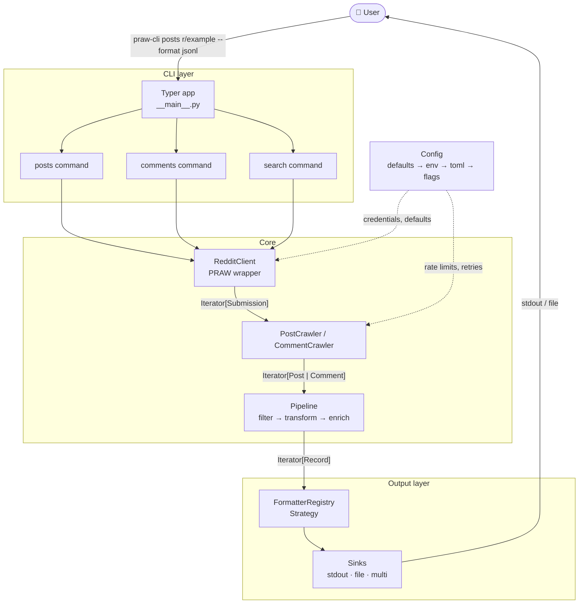
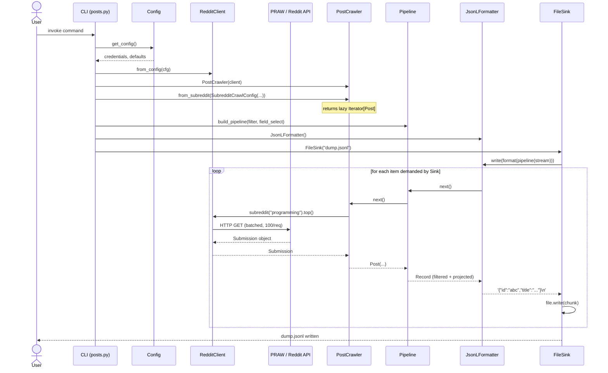

# System Architecture

**praw-cli** is built for composability: fetch posts and comments from any source, shape data through a lazy pipeline, and emit it in any format to any destination.

## Design Principles

| Principle                        | Implication                                                                       |
| -------------------------------- | --------------------------------------------------------------------------------- |
| **Lazy by default**              | The entire data path is `Iterator[T]`. A 100k-post crawl uses constant memory.    |
| **Strict layer isolation**       | `praw` never leaks past `client/`. Pipeline stages are unaware of output formats. |
| **Open/closed**                  | Adding a new output format means registering one class — nothing else changes.    |
| **Credentials never in argv**    | Auth is resolved through the config layer, never passed as CLI positional args.   |
| **Fail per-item, not per-crawl** | A deleted post or suspended author logs a warning and the crawl continues.        |

## System Overview

## Layer Breakdown

### 1. CLI Layer — `src/prawler/cli/`

Entry point for the user. Responsible for argument parsing, help text, and wiring dependencies together. Contains **no business logic**.
Each sub-command constructs the appropriate `*CrawlConfig`, assembles pipeline stages from CLI flags, selects a formatter and sink, then connects the stream.

### 2. Client Layer — `src/prawler/client/`

The only module allowed to import `praw`. Acts as an **anti-corruption layer**: all PRAW primitives (`praw.models.Submission`, `praw.models.Comment`) are consumed here and never escape into the rest of the codebase.
`RedditClient.from_config()` is the only factory.

### 3. Crawler Layer — `src/prawler/crawler/`

Maps PRAW models to domain models (`Post`, `Comment`). Each crawler exposes one method per crawl mode and returns a lazy `Iterator[DomainModel]`.
Network errors that surface after the iterator is open are logged at `WARNING` level and skipped, not propagated.

### 4. Pipeline Layer — `src/prawler/pipeline/`

A chain of `PipelineStage` callables, each typed `(Iterator[T]) -> Iterator[T]`. Stages are pure transformations — they do not perform I/O and are stateless.

### 5. Output Layer — `src/prawler/output/`

Two orthogonal abstractions: **formatters** (serialization) and **sinks** (destination). Any formatter can be paired with any sink.

## Data Flow

End-to-end flow for `praw-cli posts r/<subreddt> --sort top --filter "score>=500" --fields id,title,score --format jsonl --output dump.jsonl`.

Note that **no list is ever fully materialised**: `Sink.write()` iterates chunks one at a time, which pulls through `Formatter → Pipeline → Crawler → PRAW` on demand.

## Key Design Patterns

- **Strategy**: `Formatter` is a `Protocol`. The CLI selects an implementation at runtime via `FORMATTERS[format]()`. No `if/elif` chain anywhere in the codebase.
- **Chain of Responsibility**: Each stage is `Callable[[Iterator[T]], Iterator[T]]`. Stages are composed with `build_pipeline(*stages)` and know nothing about each other.
- **Factory Method**: `RedditClient.from_config(cfg)` is the single authorised construction path. It extracts credentials, applies defaults, and returns a ready instance.
- **Anti-Corruption Layer**: `praw` is a third-party library with its own object model. The `client/` package is the only place that depends on it.
